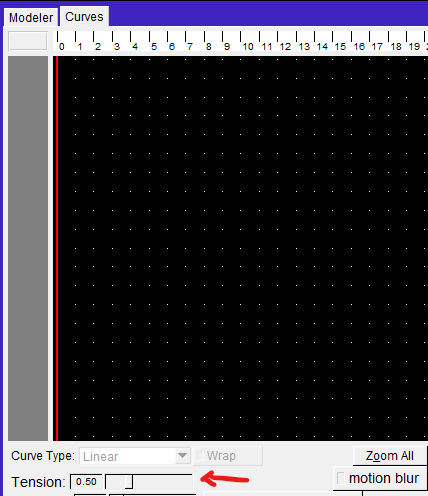
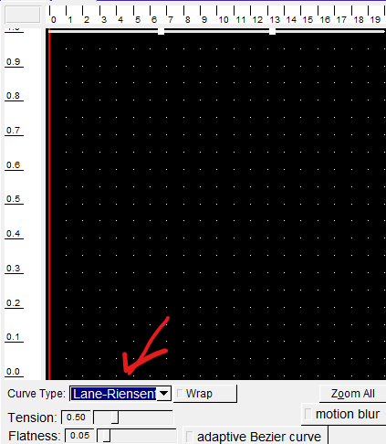
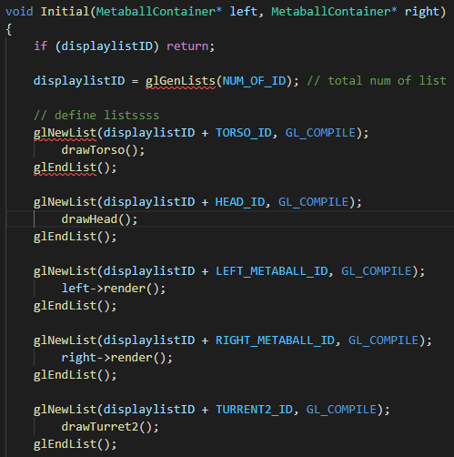

# Animator

Impressionist is an interactive program that creates pictures that look like impressionistic paintings. It is based on a paper and a program by Paul Haeberli. Here is the web "Paint by Numbers".
To create an impressionistic picture, the user loads an existing image and paints a seqence of "brush strokes" onto a blank pixel canvas. These brush strokes pick up color from the original image, giving the look of a painting.

## TODO:

### Required Tasks:

- [x] Implement the following curve types with support for wrapping:
- [x] Bézier (splined together with C0 continuity)
- [x] B-spline
- [x] Catmull-Rom
- [x] Implement a particle system that is integrated with your model in some way.
- [x] Animation

### Extra Tasks:

||Task|Done|
|-|-|-|
|W|spline control options|✔✔|
|W|TGA||
|W|mirror|✔|
|W|billboard|✔|
|W|Fire/snow/water/firworks||
|W|environment mapping||
|W|motion blur|✔|
|W|sky box|✔|
|W|Runge-Kutta||
|W|OpenGL Display list|✔|
|W|de Casteljau + flatness|✔✔|
|B|spring-mass system||
|B|collision detection AND handling||
|B|general subdvision curves||
|B|height fields|✔|
|B|metaballs||
|BW|lens flare||
|BW|your great UI idea||
|2B|flocks||
|2B|C2 interpolating curve||
|2B|edit CR curves||
|2B|UI to select model parts by clicking||
|2B|quaternions||
|2B|bspline surface||
|3B|projected textures||
|3B|motion warping||
|3B|cell shading||
|4B|rigid-body simulations||
|4B|subdivision surfaces||
|8B| mouse/keyboard computer games (using IK)||

### HOW TO USE:
#### Controling Tension of Catmull-Rom spline
When select curve type `catmull-rom`, using the `Tension` slider can modify the tension value of catmull-rom spline.  
Need to move the curve or press the `Wrap` button to update the curve.

#### Standard Subdivision curve (Lane-Riesenfeld)
Select curve type `Lane-Riesenfeld` to create standard subdivision curve.

#### Mirror
On the left side of the character, there is a mirror.

#### Billboard
On the right side of the character, there are two images as billboard.

#### Motion Blur
Enable motion blur by pressing the button.
Move the camera or make the model move.

#### Skybox
Look around the model to see the sea view skybox.

#### Display List
A display list is implemented to improve the rending speed.

#### Adaptive Bézier Curve
Select curve type `Bézier`.
Enable adaptive Bézier curve by pressing the button.
Control the threshold of flatness by the slider.
Num of points is displayed by printf.

#### Height field
Look the blue plate under the model.